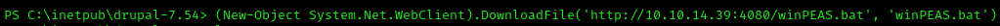

Bastard is medium difficulty OSCP-like machine based in Linux.
Our research started with a nmap scan to detect open ports, running services and soft version: 
 
There we can see an 80, 135 and 49154 open ports. The last one is a web server: 
 
Wappalyzer detects a Drupal with version 7.x. Let's check version manually with changelog file: 
 
Changelog tell us that Drupal version is 7.54. Check its version in Searchsploit: 
 
There are a lot of vulnerabilities. In our case may be handy a Drupalgeddon2 vulnerability with RCE: 
 
We got a shell. Let's stable him with reverse shell: 
 
OK, now we are under authority\iusr account. We can get a user's flag: 
 
Next step is collect information about system to build a privilege escalation vectors. Let's download on machine winPEAS: 
 
Is shows us a base system info: 
 
Additionally we can spot a missing hotfixes: 
 
After a number of trying a different vulnerabilities we found a MS10-059. Download its exploit to machine: 
 
And running it to get a reverse shell: 
 
Success, now we are under authority\system account: 
 
Let's get a root flag: 
