Cronos is medium difficulty OSCP-like machine based on Linux.
Let's start our research with a nmap scan to detect open ports, running services and soft version: 
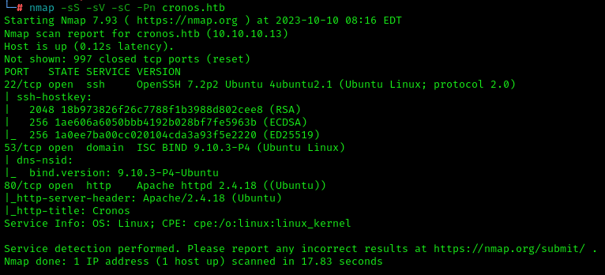
We can spot an 22, 53 and 80 open ports. The last one is a web-server: 
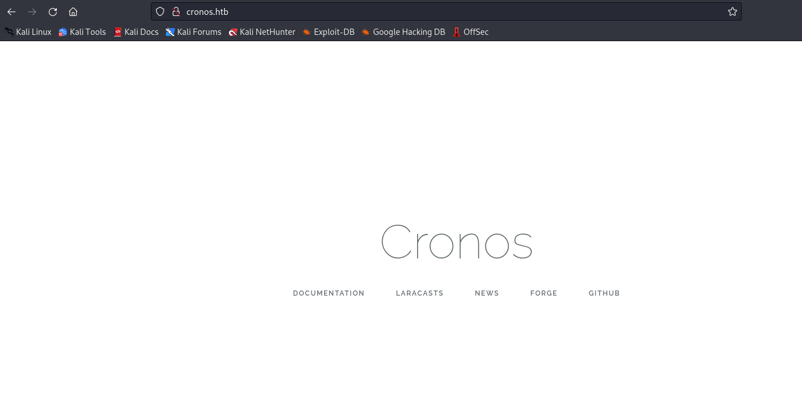
Fuzzing directories is don't give us interesting information except URL /web.config: 
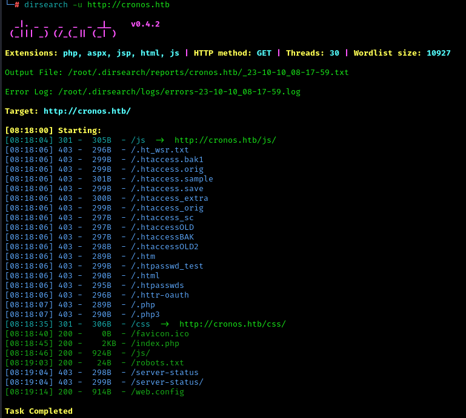
Web.config's content is a rules of webserver that matches end replaces URL with regexp: 
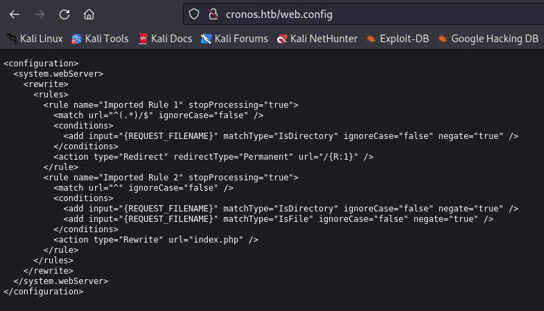
Further directories fuzzing showed no results unlike subdomains fuzzing: 
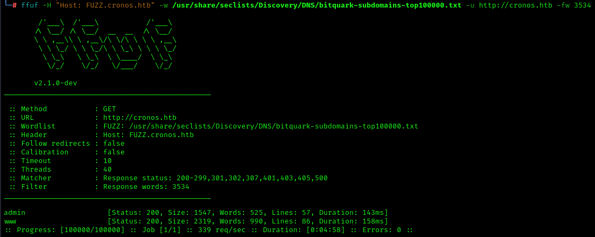
There we can see a subdomain «admin». Let's check it out: 
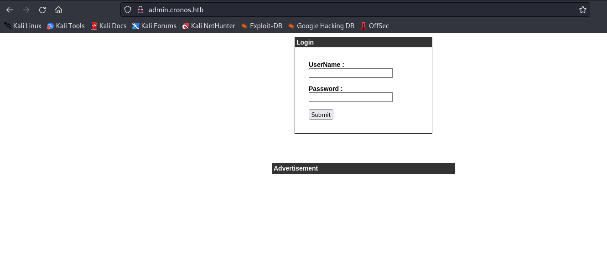
Here we can spot an auth panel. Additional checks shows us an SQL-injection that we can use to bypass auth system: 
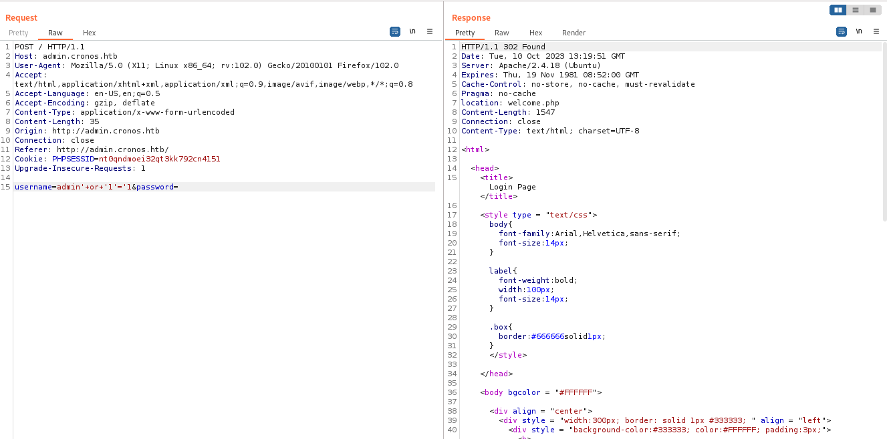
and we receive a redirect to /welcome.php: 
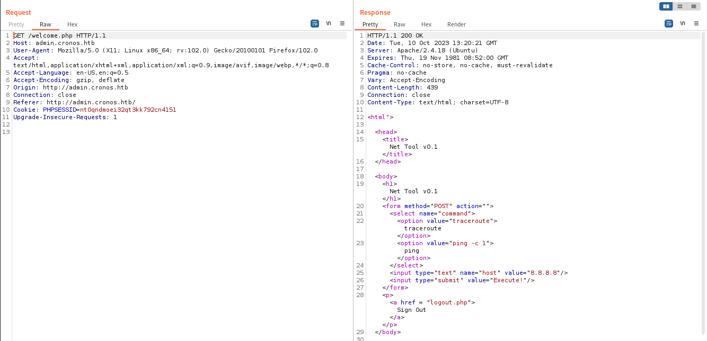
Let's see that page in a browser: 
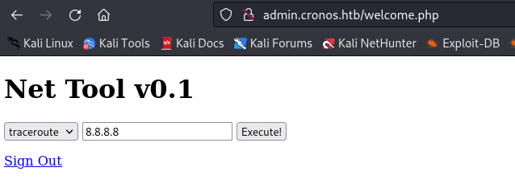
It seems like a ping online tool which often vulnerable to command-injections. Let's try to execute any command by adding a semicolon: 
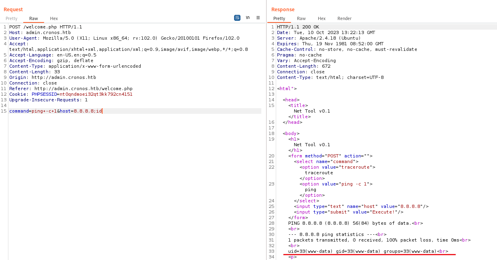
Now we can do many things such as reading local files with config: 
![]11.png)
Next step is gaining reverse shell with python command and running netcat on our attacker machine: 
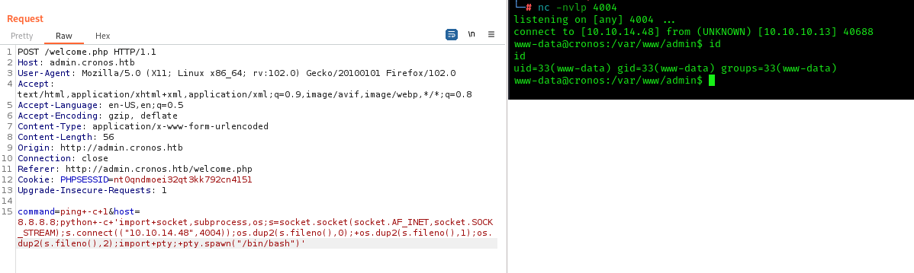
That's it, we are in system under www-data account. Now we can try to read **user's flag**: 
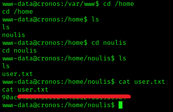
For privilege escalation we will use an LinPEAS script. Download it from attacker machine and run: 
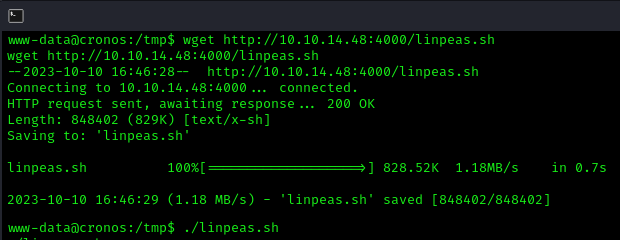
LinPEAS show us a lot of information like a system info and much more: 
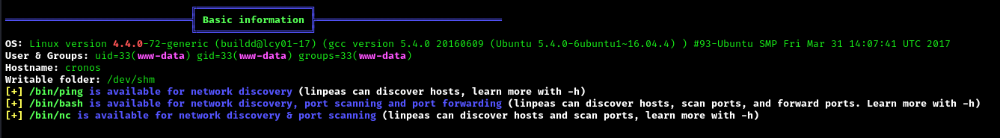
Attention attracts by task scheduler that show us a every-minute running script in /var/www/laravel directory: 
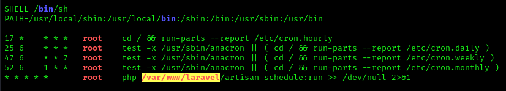
Besides we can spot a credentials to DB, redis etc.: 
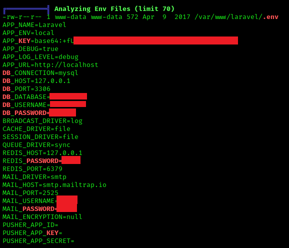
Moving to laravel folder shows us many files: 
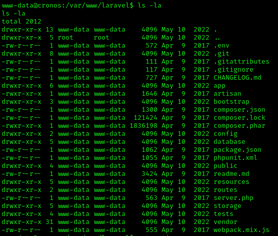
Artisan file contains an PHP-code that we can edit: 
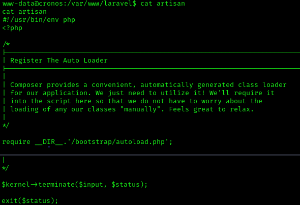
For further step we need to prepare. Create a php reverse shell file on attacker machine: 
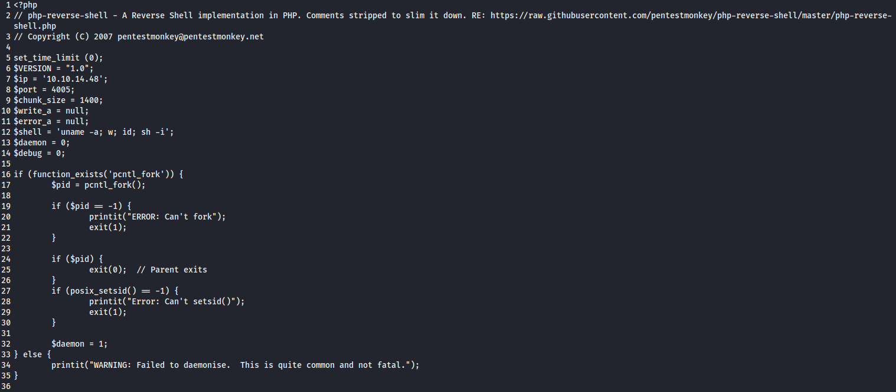
and upload it to cronos machine as artisan file: 
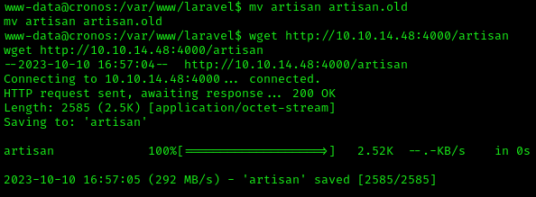
Use netcat to catch incoming connection and wait about one minute:
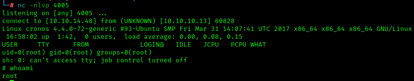
Now we're under root account. Let's get **root's flag**:
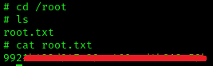
