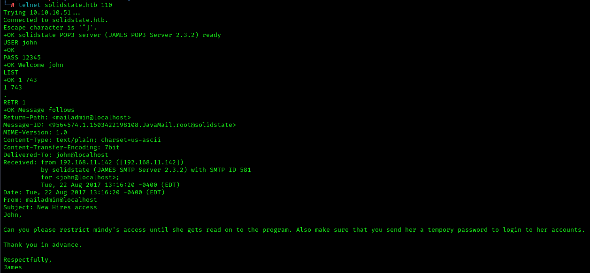

Solidstate is medium difficulty OSCP-like machine based on Linux.
Let's start research with a nmap scan to detect open ports, running services and soft version: 
 
There we can see a lot of open ports, most interesting is 25 and 80. The last one is web server: 
 
We can fuzz him to find directories 
 
 
and subdomains 
 
But nothing is founded. We can enumerate SMTP with nmap default scripts: 
 
We have a one username - root. With knowing version of SMTP (James 2.3.2) we can check vulnerabilities via searchsploit: 
 
One of them can give us a RCE. Checking his source code show us default credentials for James 2.3.2: 
 
Running exploit is successfully, but now we need that somebody login in to server to trigger our payload: 
 
Swift googling reveals that James SMTP usually uses a 4555 port to manage service. Check it with nmap: 
 
Port is open. Let's login into with known credentials: 
 
Success. Now we can enumerate users and reset their passwords to read mails: 
 
With this usernames let's check mails via 110 port: 
 
Mailadmin tells john that there is a new employee, who needs to send a new credentials: 
This employee exists in our usernames list. Check her mailbox: 
 
Here we get an ssh credentials. Try to login: 
 
Mindy does not have permissions to take any action, but we got reverse shell already: 
 
Now we got a user flag. Let's run LinPEAS to check possible privilege escalation vectors: 
 
We can spot a strange file tmp.py. Check it: 
 
This script clears /tmp directory. Placing txt files into /tmp show us that script runs regularly. 
We can edit script to get reverse shell when he triggers: 
 

